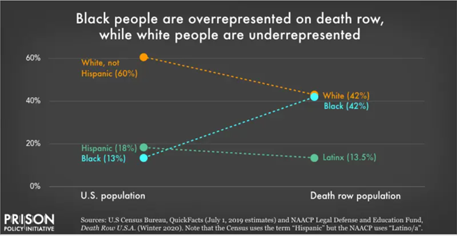

# *Assignment: Critique by Design*

# Critiqued Visualization
The visualization I am critiquing is from the Prison Policy Initiative and it is titled "Black people are overrepresented on death row, while white people are underrepresented."

I chose this visualization because I think the information is important for people to know and undestand in order to advocate for changes in our broken criminal justice system, but when I first saw it, it took me a while to figure out what the graph was attempting to show. Since this is a slope graph, it makes it seem like the data is saying that the percentage of Black people on death row has increased over time; however, when you look at the x-axis, it shows that the first dot is actually the percent of the population each race makes up and the second dot is the percent of death row each race makes up. The slope graph is very misleading and if you do not take the time to process every element of the visualization, you may walk away with incorrect information. I think due to the audience most liklely being advocates for criminal justice reform or abolishing the death penalty, this could cause them to spread the misinformation to others and really harm the validity of the cause they are supporting. Through critiquing, I realized that this incorrect choice of visualization type really impedes the effectiveness of the visualization even though it has all the data necessary to make the point. I wanted to redesign this visualization into another data graph type in order to display the information more intuitively and hopefully allow people to understand the information more clearly. After critiquing and analyzing the visualization, I began to wireframe possible solutions.

# Wireframes

# Testing the Wireframes

After sketching my ideas, I asked two friends multiple questions about each of the sketches. Their answers for each sketch are below.

**Pie Chart**

1. Tell me what you think this is?

Friend 1: "A comparison of the U.S. population and the death row population."
  
Friend 2: "It would be looking at the population of the U.S. compared to the population of the death row."
  
2. Can you describe to me what this is telling you?

Friend 1: "That there are a larger percentage of White people in the U.S. then on death row, and a larger percentage of POC on death row than in the U.S."
  
Friend 2: "It is showing a disparaity between Black and White death row populations. It is pretty evident that Black individuals are more likely to be put on death row."
  
3. Who do you think the intended audience is?

Friend 1: "I don't know. People? Lawmakers?"
  
Friend 2: "I think most people should see this. I would see this in a college criminology or sociology class."
  
4. Is there anything you would change or do differently?

Friend 1: "It is hard to compare White to White and BLack to Black."
   
Friend 2: "I almost want a comparison of men and women, and if there are disparities between Black women and White women."

**Bar Chart**

1. Tell me what you think this is?**

Friend 1: "It's comparing the percentage of White people in the U.S. to the percentage of White people that make up death row, and the percentage of Black people in the U.S. to the percentage of Black people that make up the death row."
  
Friend 2: "A bar chart comparing the percentage of the U.S. population with the percentage of the death row population."
  
2. Can you describe to me what this is telling you?

Friend 1: "It's telling me that the percentage of Black people on death row is larger than their population in the U.S. and the reverse for White people."
  
Friend 2: "Similar to my previous statement, it is showing the disparity between White and Black people and how Black people make up a larger population of death row despite making up a smaller population of the U.S."
  
3. Who do you think the intended audience is?

Friend 1: "I still do not know."
  
Friend 2: "Same as before."
       
4. Is there anything you would change or do differently?

Friend 1: "The shading is confusing. I want to compare the shaded parts to each other and the not-shaded parts to each other."
  
Friend 2: "I would put the population on the bottom, like the descriptors. So the legend would be White and Black and the axis would be population. I would also include other populations."
  
**Stacked Bar Chart**
  
1. Tell me what you think this is?**

Friend 1: "Comparing the demographics of the U.S. population to the demographics of the death row population."
  
Friend 2: "It's the same as my previous answers."
  
2. Can you describe to me what this is telling you?

Friend 1: "That they do not match, and that the death row population has more non-White people in it."
  
Friend 2: "It's showing that there are more White people and less Black people and Latinx people in the U.S., but equal percentages of Black people and White people in death row population."
  
3. Who do you think the intended audience is?

Friend 1: "Same as before, but more for lawmakers than the average person."
  
Friend 2: "I think this would be more advanced and maybe for lawmakers."
  
4. Is there anything you would change or do differently?

Friend 1: "I think it just confused me that the order you stacked them in was different. It made it hard to compare."
  
Friend 2: "I think this chart might be the most thorough, and I think it being stacked up to 100 makes sense. I think the drawing is the only thing that throws me off."
  
**Which one do you like the best, and why?**

Friend 1: "I think the last one does the best job of comparison, but I think the bar chart with some changes would be the best."

Friend 2: "Maybe the bar chart because I think it is the least complicated way to compare them."
