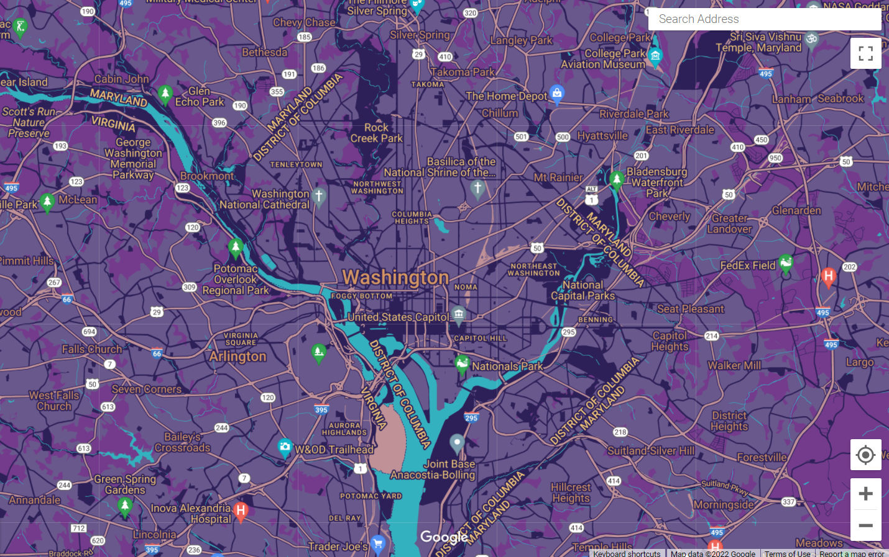

# Assignment: Build and Deploy a Custom Google Map for a Non-Profit Organization

## The Organization and Color Palette

## The Map

## The Map Code

[ { "elementType": "geometry", "stylers": [ { "color": "#69588c" } ] }, { "elementType": "labels.text.fill", "stylers": [ { "color": "#f2c777" } ] }, { "elementType": "labels.text.stroke", "stylers": [ { "color": "#2d2059" } ] }, { "featureType": "administrative.country", "elementType": "geometry.stroke", "stylers": [ { "color": "#2d2059" } ] }, { "featureType": "administrative.land_parcel", "elementType": "labels.text.fill", "stylers": [ { "color": "#f2c777" } ] }, { "featureType": "administrative.locality", "elementType": "labels.text.fill", "stylers": [ { "color": "#d59563" } ] }, { "featureType": "administrative.province", "elementType": "geometry.stroke", "stylers": [ { "color": "#2d2059" } ] }, { "featureType": "landscape.man_made", "elementType": "geometry.stroke", "stylers": [ { "color": "#2d2059" } ] }, { "featureType": "landscape.natural", "elementType": "geometry", "stylers": [ { "color": "#743b8c" } ] }, { "featureType": "poi", "elementType": "labels.text.fill", "stylers": [ { "color": "#f2c777" } ] }, { "featureType": "poi", "elementType": "labels.text.stroke", "stylers": [ { "color": "#2d2059" } ] }, { "featureType": "poi.park", "elementType": "geometry", "stylers": [ { "color": "#2d2059" } ] }, { "featureType": "poi.park", "elementType": "labels.text.fill", "stylers": [ { "color": "#f2c777" } ] }, { "featureType": "road", "elementType": "geometry", "stylers": [ { "color": "#2d2059" } ] }, { "featureType": "road", "elementType": "geometry.stroke", "stylers": [ { "color": "#212a37" } ] }, { "featureType": "road", "elementType": "labels.text.fill", "stylers": [ { "color": "#f2c777" } ] }, { "featureType": "road", "elementType": "labels.text.stroke", "stylers": [ { "color": "#2d2059" } ] }, { "featureType": "road.highway", "elementType": "geometry", "stylers": [ { "color": "#c09298" } ] }, { "featureType": "road.highway", "elementType": "geometry.stroke", "stylers": [ { "color": "#2d2059" } ] }, { "featureType": "road.highway", "elementType": "labels.text.fill", "stylers": [ { "color": "#f2c777" } ] }, { "featureType": "road.highway", "elementType": "labels.text.stroke", "stylers": [ { "color": "#2d2059" } ] }, { "featureType": "transit", "elementType": "geometry", "stylers": [ { "color": "#2f3948" } ] }, { "featureType": "transit", "elementType": "labels.text.fill", "stylers": [ { "color": "#f2c777" } ] }, { "featureType": "transit", "elementType": "labels.text.stroke", "stylers": [ { "color": "#2d2059" } ] }, { "featureType": "transit.line", "elementType": "geometry.fill", "stylers": [ { "color": "#c09298" } ] }, { "featureType": "transit.station", "elementType": "geometry", "stylers": [ { "color": "#c09298" } ] }, { "featureType": "transit.station", "elementType": "labels.text.fill", "stylers": [ { "color": "#d59563" } ] }, { "featureType": "water", "elementType": "geometry", "stylers": [ { "color": "#34b1bf" } ] }, { "featureType": "water", "elementType": "labels.text.fill", "stylers": [ { "color": "#2d2059" } ] }, { "featureType": "water", "elementType": "labels.text.stroke", "stylers": [ { "color": "#17263c" } ] } ]

## Feature Changes

| Feature Type | Element Type | Stylers |
|--- | --- | --- |
| All | Geometry | Color: Lighter Purple #69588C |
| All	Labels | Text fill | Color: Yellow #F2C777  |
| All	Labels | Text outline	| Color: Dark Blue #2D2059 |
| Country	| Geometry/Stroke	| Color: Dark Blue #2D2059 |
| Province | Geometry/Stroke |	Color: Dark Blue #2D2059 |
| Land parcel	| Labels/Text fill | Color: Yellow #F2C777 |
| Landscape Human-made |	Geometry/Stroke	| Color: Dark Blue #2D2059 |
| Landscape Natural | Geometry | Color: Purple #743B8C |
| Points of interest |	Labels/Text fill |	Color: Yellow #F2C777 |
| Points of interest |	Labels/Text fill outline | Color: Dark Blue #2D2059 |
| Points of interest | Park	Labels/Text fill | Color: Yellow #F2C777 |
| Road | Geometry |	Color: Dark Blue #2D2059 |
| Road | Labels/Text fill	| Color: Yellow #F2C777 |
| Road |	Labels/Text outline |	Color: Dark Blue #2D2059 |
| Road/Highway | Geometry	| Color: Dusty Pink #C09298 |
| Road/Highway |	Geometry / Stroke |	Color: Dark Blue #2D2059 |
| Road/Highway |	Labels/Text fill |	Color: Yellow #F2C777 |
| Road/Highway |	Labels/Text outline |	Color: Dark Blue #2D2059 |
| Transit |	Labels/Text fill | Color: Yellow #F2C777 |
| Transit |	Labels/Text outline | Color: Dark Blue #2D2059 |
| Transit/Line |	Geometry/Fill	| Color: Dusty Pink #C09298  |
| Transit/Station	| Geometry | Color: Dusty Pink #C09298 |
| Water |	Geometry |	Color: Teal #34B1BF |
| Water |	Text fill |	Color: Dark Blue #2D2059 |
