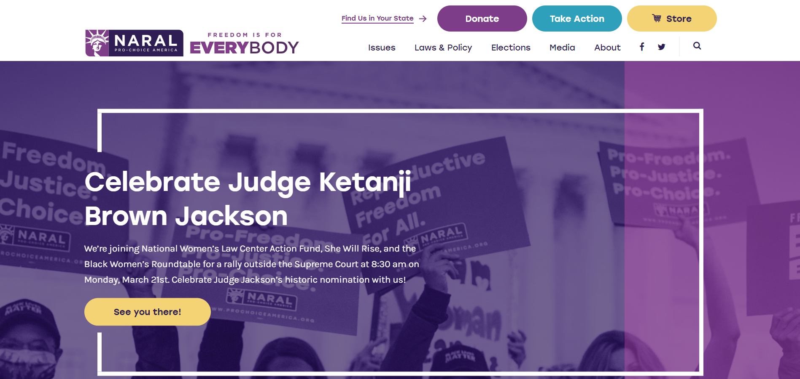
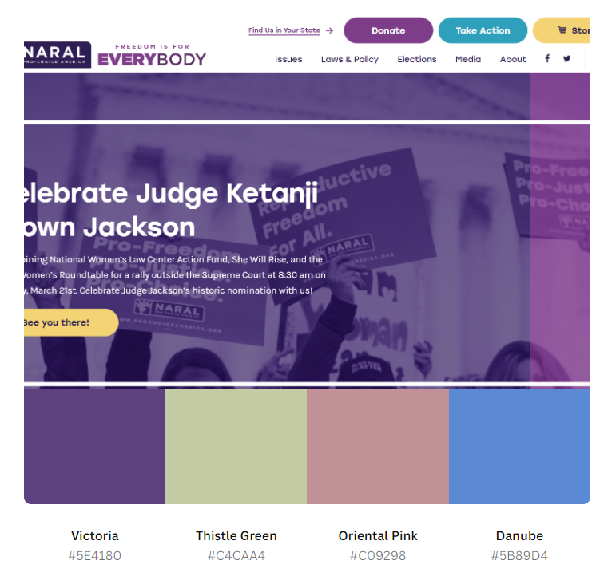
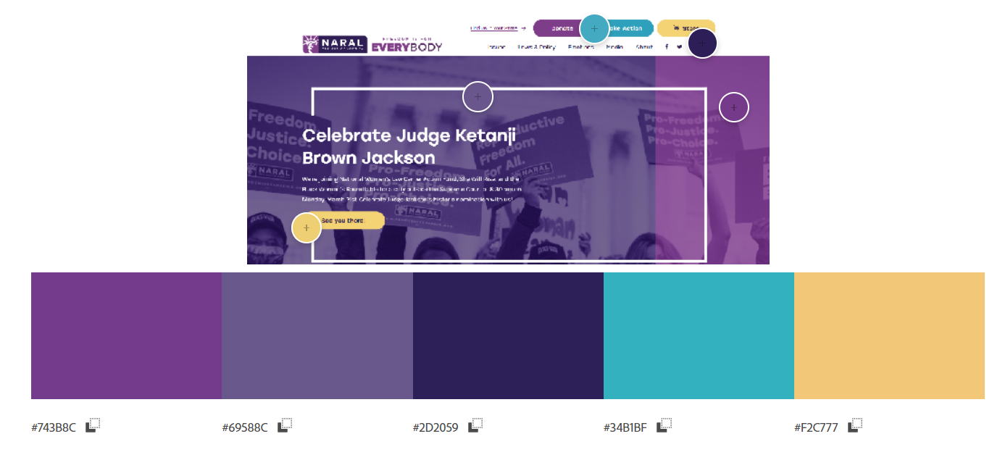
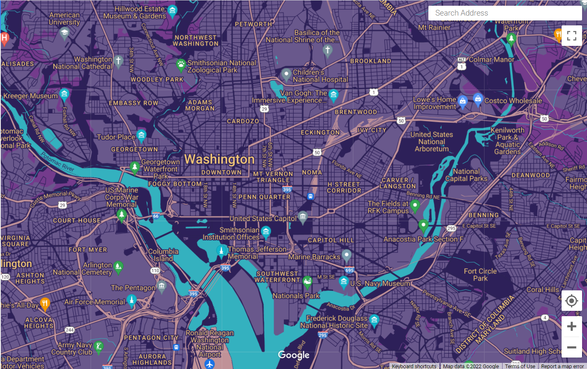

[Link Back to Advanced GIS Portfolio](AdvancedGISAssignments.md)

# Assignment: Build and Deploy a Custom Google Map for a Non-Profit Organization

## The Organization and Color Palette

The organization that I picked was NARAL Pro-Choice America, which fights for reproductive rights. I imagine this map may be used at a local level to locate reproductive health resources and abortion clinics. The screenshot I used for making the color palettes is below.

Based on the screenshot, I used Canva and Abode to get some color palettes for the organization. Using these colors, I created a custom Google map. A screenshot of the map is below as well as the code and a summary of the feature changes. 

## The Map

## The Map Code

The map's code is linked below in JSON format. 

[Map Code](Code.json)

## Feature Changes

| Feature Type | Element Type | Stylers |
|--- | --- | --- |
| All | Geometry | Color: Lighter Purple #69588C |
| All	Labels | Text fill | Color: Yellow #F2C777  |
| All	Labels | Text outline	| Color: Dark Blue #2D2059 |
| Country	| Geometry/Stroke	| Color: Dark Blue #2D2059 |
| Province | Geometry/Stroke |	Color: Dark Blue #2D2059 |
| Land parcel	| Labels/Text fill | Color: Yellow #F2C777 |
| Landscape Human-made |	Geometry/Stroke	| Color: Dark Blue #2D2059 |
| Landscape Natural | Geometry | Color: Purple #743B8C |
| Points of interest |	Labels/Text fill |	Color: Yellow #F2C777 |
| Points of interest |	Labels/Text fill outline | Color: Dark Blue #2D2059 |
| Points of interest | Park	Labels/Text fill | Color: Yellow #F2C777 |
| Road | Geometry |	Color: Dark Blue #2D2059 |
| Road | Labels/Text fill	| Color: Yellow #F2C777 |
| Road |	Labels/Text outline |	Color: Dark Blue #2D2059 |
| Road/Highway | Geometry	| Color: Dusty Pink #C09298 |
| Road/Highway |	Geometry / Stroke |	Color: Dark Blue #2D2059 |
| Road/Highway |	Labels/Text fill |	Color: Yellow #F2C777 |
| Road/Highway |	Labels/Text outline |	Color: Dark Blue #2D2059 |
| Transit |	Labels/Text fill | Color: Yellow #F2C777 |
| Transit |	Labels/Text outline | Color: Dark Blue #2D2059 |
| Transit/Line |	Geometry/Fill	| Color: Dusty Pink #C09298  |
| Transit/Station	| Geometry | Color: Dusty Pink #C09298 |
| Water |	Geometry |	Color: Teal #34B1BF |
| Water |	Text fill |	Color: Dark Blue #2D2059 |

In order to create this custom Google map, I used Google's Map Syling Wizard. I started with the template "Night" because it was a similar theme to what I wanted to create. From there, I made the above color changes using the color palettes that were generated. I checked the map at different zoom extents to make sure that the colors work at various views. I wanted the map main colors to be the same purples as the main theme of NARAL. I then used to accent colors of yellow, pink, and blue for the accent features such as the labels, water, and roads. 
