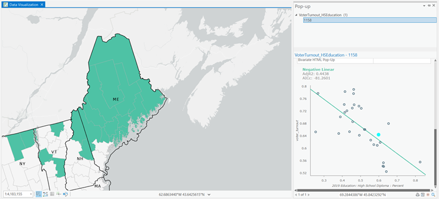

# Assignment: Data Engineering and Visualizations

For the first part of this assignment, I learned how to utilize ArcGIS Notebooks in ArcGIS Pro to perform data engineering tasks. ArcGIS Notebooks are built using cells tha contain executable Python code, or explanatory text/media using Markdown. I also learned how to geoenrich data in ArcGIS Pro, which I had previously learned how to do in ArcGIS Insights. I think that geoenriching data would be very useful for adding Census-type data to another data set since it is so common to use Census data in analyses. It takes away the need to find the data yourself on the Census database and clean it.  

In the second part of the assignment, using the data from the first part, I explored some of the graphing and data visualization tools available in ArcGIS Pro. I was able to utilize descriptive statistics, histograms, bar charts, box plots, scatterplots, and the local bivariate relationship tool.

## Screenshots from Assignment

### Part One: ArcGIS Notebooks

This screenshot shows some of the code used in the Notebook to clean and engineer the dataset. The code shown is calculating new fields.

### Part Two: Data Visualization

This screenshot shows the relationship between voter turnout and the percent of the population with a high school diploma by county. The screenshot is showing the scatterplot based on state and highlighting the county I selected to show that county's specific relationship. Having this pop-up feature in ArcGIS Pro is very useful for examining specific areas of interest easily.

## Assignment Reflections

For the first exercise, I see myself using Notebooks as a log of the process I am taking when working on a project. I do not know Python, so I do not know if I would be able to use the coding as much as I would like, but I think having the space within ArcGIS Pro to keep track of the work being done is very helpful for communicating and for sharing work. In the introductory class, we had to keep a log of data cleaning and data analysis for our final project and I think that process would have been easier if we could have done it in Notebooks instead of switching to a different document every time we needed to log something. I think learning about the Enrich function was also very helpful. It makes adding data to your work much easier and cleaner than finding it, cleaning it, and importing it yourself.  

For the second exercise, I did not realize how many data visualizations ArcGIS Pro could do. I think knowing how to use those advanced graphing capabilities in the software can be great for making more informative dashboards and representing the data in different ways. I think it also is helpful for being able to look at the whole picture but also being able to select certain states or counties to get a more granular look. It is also just helpful to have the visualizations for a better understanding of the data. When working on projects with a lot of data, it is sometimes difficult to know everything about the data, but having visualizations makes it easier to examine. I do think that the way that you can have different cards in ArcGIS Insights is nicer for looking at all the different graphs and maps at the same time, as it can be a little crowded and hard to see everything in ArcGIS Pro if you have multiple windows open, but it seems you have more control over the visualizations in ArcGIS Pro.
