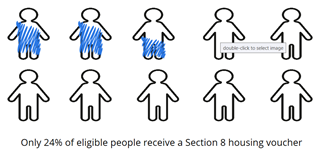
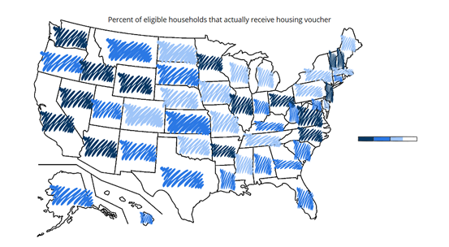
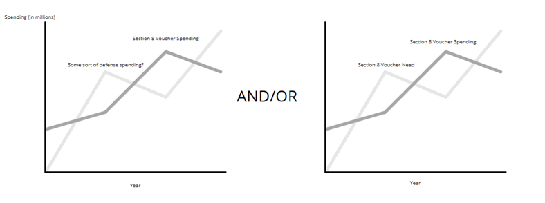
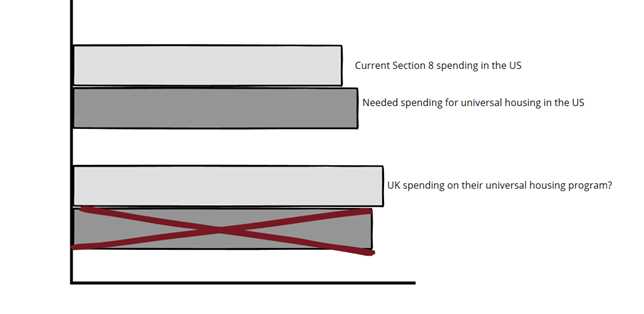

[Back to Final Project Page](FinalProject.md)

# Final Part One: Initial Planning

This is part one of my final project. I will describe my project outline, provide some initial sketches, share the data, and discuss the methods for the final design.

# Project Outline

For my final project, I want to use data visualizations to tell the story of the affordable housing crisis in America. I think this is a topic that has not gotten the attention it deserves, but has been brought to light more due to the COVID-19 pandemic. I want to show the dire situation America is in, but then offer a solution that readers can advocate for to improve housing in America: a universial housing program.

I was inspired to dive into affordable housing after reading Evicted by Matthew Desmond. I think the reason his book was so engaging was because it followed real people through their struggles with housing. So, to start my story, I will have a short introduction of a fictional family and their struggle with housing in order to illustrate the importance of the issue by tying it to a human experience. I may try to connect it to the pandemic because I think the pandemic has gotten more people aware of the affordable housing crisis America has. I want to have some sort of graphic depicting how imperative affordable and safe housing is for wellbeing and escaping the cycle of poverty, but I am not sure if it will go in the introduction or somewhere else in the story. I will then go into a very brief history and explaination of Section 8 housing vouchers to orient the reader into what the current system is like in America, but I do not want to spend too much time because I think it is a little boring if I go too in depth. This could include a simple timeline if necessary, but I am not certain on that. Next, I will show the ineffectiveness of the program with visuals. I am wanting to use visualizations to show how many eligible people actually receive vouchers and how much America spends on Section 8 vouchers compared to other programs/agencies. At this point, my readers should be unhappy with the current situation in America, and I then want to show them that there is another way. I will introduced what a universal housing program is, and what it could look like in America. I am wanting to use contrasting visuals/data to what I used to show the current system based on what the program would entail and using data/examples from countries that have a universal housing program. After showing the readers what America's affordable housing system could look like, I will urge the readers to contact their representatives and ask them to support any policies expanding access to affordable housing, as well as urge them to look into how they can help low-income, rent-burdened people in their communities, whether through mutal aid funds, advocating for more affordable housing in their neighborhoods, or working with local renter's rights groups.

# Initial Sketches

I utilized Balsamiq Wireframes to create my initial sketches.

My first two sketches are to illustrate that our current program is not serving near as many people as are in need of rental assistance. These would be in the part of the story focused on showing the problems with our current system. The first is a visualization of the percent of eligible people in the United States actually receive a voucher. I wanted to use a simple, easy understand visualization to get the point across right away.

My second sketch breaks down the percent of eligible people in each state that actually receives a housing voucher. I want to see how bad the housing crisis is in each state, and knowing how your state stacks up might be intriguing for the reader. I think this data allows the reader to see this is a nationwide issue and not just an issue in states that have high costs of living.

My third sketch contains two line graphs. The first compares Section 8 voucher funding over time and the funding over time for another government program. I have not decided which program I want to compare it to, but I am trying to illustrate how the Section 8 progarm does not get adequate funding compared to other programs that may not have the same importance. This would also be in the part of the story going through the problems with the current system. The second line graph is a comparison of section 8 voucher funding over time and the increasing need for affordable housing. I am not sure if I will use both of these ideas or just one, but I think both can be important for illustrating that the federal government does not provide enough resources for affordable housing, even though it is one of the most important needs low-income families have.

My fourth sketch is a bar chart that compares the current spending for Section 8 vouchers, the estimated spending needed for a universal housing program in the United States, and how much the United Kingdom spends on their universal housing program. This wouuld be in the section talking about a universal housing program. I am wanting to show how large of an increase will be necessary to expand the voucher program to be universal, and show how it compares to other countries with similar programs. My goal is to show that if other countries can do it, we can too.

There are other graphics that I will need to make in order to finish my story. I will need to do more research to formulate a graphic to show how important housing is for general wellbeing. I also imagine as I write my story there will be other points that I can make a simple graphic to draw attention to the main points I am trying to make. For example, when discussing the universal housing program a simple graphic showing that 100% of eligible people would receive a housing voucher under the program.

# Data

I will be utilizing the United States Census Bureau's 2019 American Community Survey data regarding income levels in each state, as well as the Center on Budget and Policy Priorities' 2019 National and State Housing Data. I will use these two data sets in combination to show the ratio between how many people in each state qualify for Section 8 vouchers and how many actually receive it. I can also use the Center on Budget and Policy Priorities' data to show how many people in the United States receive assistance at all, and how much funding each state gets for housing assistance. I want to show how limited our program is by showing how few of qualified people actually receive assistance in each state.

[United States Census Bureau Data: American Community Survey, Income in the Past 12 Months (In 2019 Inflation-Adjusted Dollars)](State Income Data 2019.xlsx)

[Center on Budget and Policy Priorities: 2019 National and State Housing Data](Section 8 Housing Data by State 2019.xlsx)

I will also use the past few budgets of the Department for Housing and Urban Development to see how spending for the program has changed to compare it to need and/or to the spending on other government programs. I want to illustrate that the program is extremely underfunded and that it requires more spending in order to provide for everyone eligible to receive the voucher. I will also use this data to compare to how much the United States would need to spend to fund the program fully.

[Department of Housing and Urban Development Budgets](https://www.hud.gov/budget/additional)

Throughout the project, there will be other data points that I will need to complete my story, especially regarding the universal housing program; however, these will most likley be singular data points that will come from various sources as opposed to a whole data set that I will need to work with. Since a universal housing program does not exist in the United States, I have not been able to find a data set to work with, but I have been able to find singular pieces of data that can help with my story, such as how much a universal housing program would cost the United States.

# Methods and Mediums

To prepare for my final project, I will be completing storyboards and user research to ensure that my project tells the story I am wanting to tell. I plan to ask a few friends, who may not be as familiar with the topic, for my user reserach. I imagine my audience will not be extremely informed on the topic, so it will be important to gauge the opinions and outlooks of those not as knowledgable of the affordable housing crisis. I imagine I will have to go through a few iterations of sketches, and may have to get rid of or add some that I have not even thought of yet. I will also have to continue doing research on the topic, especiallly on universal housing, to ensure I have enough of a grasp of the concept to properly visualize data and advocate for the program.

I plan on using Shorthand to organize and display the data visualizations. Shorthand seems relatively easy to utilize and allows for more creativity than a PowerPoint or any other medium that I am aware of. I will most likely use Flourish, Tableau, and Canva to build most of my visualizations. I feel comfortable using these platforms to create graphics and data visualizations. I will also explore Unsplash for any images that I may want to use in my project.
