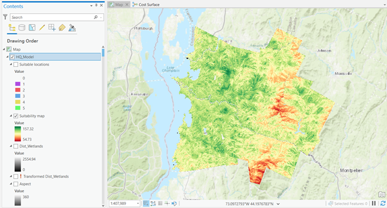

# Assignment: Suitability Models

In this assignment, I used the Suitability Modeler tool in ArcGIS Pro to find the most suitable locations for a headquarters based on various criteria. The assignment ran through the seven steps of a suitability model: defining the problem, identifying criteria, deriving criteria, transforming the criteria values, weighing and combining criteria, locating the sites, and analyzing the results. The criteria used in this model were: slope, land use, distance from major roads, visibility from major roads, distance from airports, distance from residential areas, distance from streams, distance from wetlands, and others. Each variable was weighted differently on importance. Five suitable locations were desired, and the model produced those five locations. 

## Screenshots from Assignment

This first screenshot shows the suitability map genereated by the model. The areas in dark green are the most suitable for the headquarters location and the areas in dark red are the least suitable for the headquarters location.

This screenshot shows the five locations that the suitability model picked as the most suitable locations for the headquarters. They are all located in a dark green region of the suitability map.
